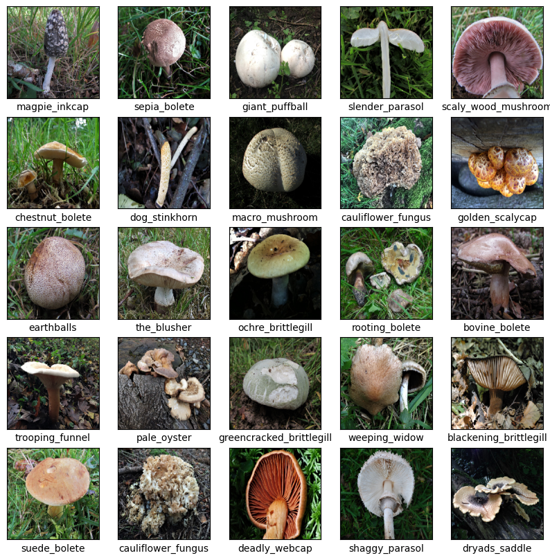
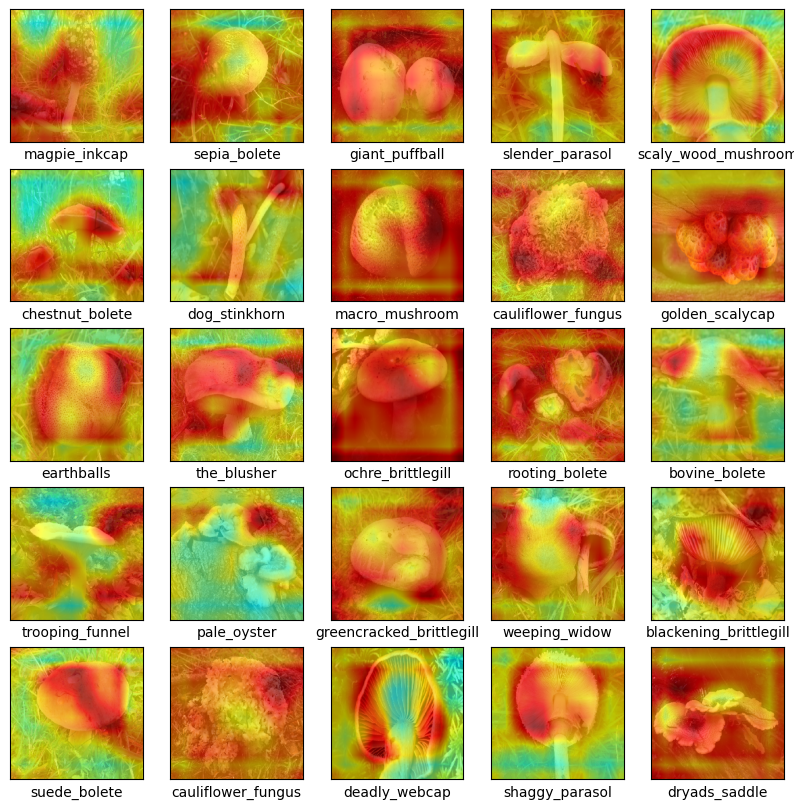

# Mushrooms images classification

## About Data
Copyright (c) 2023 Daniil Onishchenko  
(Licensed Open Data Commons Public Domain Dedication and License (PDDL) v1.0）  
[Mushrooms images classification 215 (kaggle) ](https://www.kaggle.com/datasets/daniilonishchenko/mushrooms-images-classification-215)

## About Code
This code aims to classify the mushrooms from images using Convolutional Neural Network.  
Also, In this code visualizes the images feature map using Grad-CAM.  


```python
import warnings
warnings.simplefilter('ignore')
```


```python
import os
import cv2
import random
import zipfile
import numpy as np
import matplotlib.pyplot as plt
from sklearn.model_selection import train_test_split
import tensorflow as tf
from tensorflow.keras.preprocessing.image import load_img, img_to_array,array_to_img
from tensorflow.keras.applications.vgg16 import VGG16
from tensorflow.keras.layers import Dense, GlobalAveragePooling2D
from tensorflow.keras.models import Model
from tensorflow.keras.optimizers import Adam
from sklearn.metrics import precision_score, recall_score, f1_score
from tensorflow.keras import models
```

    2023-06-08 19:44:19.009369: I tensorflow/core/platform/cpu_feature_guard.cc:182] This TensorFlow binary is optimized to use available CPU instructions in performance-critical operations.
    To enable the following instructions: AVX2 FMA, in other operations, rebuild TensorFlow with the appropriate compiler flags.


```python
%matplotlib inline
plt.rcParams['xtick.direction'] = 'in'
plt.rcParams['ytick.direction'] = 'in'
plt.rcParams['xtick.minor.visible'] = False
plt.rcParams['ytick.minor.visible'] = False
```


```python
zip_file_path = '../Input/archive.zip'
extract_folder = '../Input/mash_data'
class_list_path = 'mushrooms.txt'
```

## Loading image classification classes


```python
zf = zipfile.ZipFile(zip_file_path, 'r')
fp= zf.open(class_list_path, 'r')
cls_data = fp.read()
_class_list = list(cls_data.decode('cp932').split('\r\n'))
class_list = [cls.replace('-', '_').replace('痴','s').replace('.','') for cls in _class_list]
print(class_list)
```

    ['almond_mushroom', 'amanita_gemmata', 'amethyst_chanterelle', 'amethyst_deceiver', 'aniseed_funnel', 'ascot_hat', 'bay_bolete', 'bearded_milkcap', 'beechwood_sickener', 'beefsteak_fungus', 'birch_polypore', 'birch_woodwart', 'bitter_beech_bolete', 'bitter_bolete', 'black_bulgar', 'black_morel', 'blackening_brittlegill', 'blackening_polypore', 'blackening_waxcap', 'blue_roundhead', 'blushing_bracket', 'blushing_rosette', 'blushing_wood_mushroom', 'bovine_bolete', 'bronze_bolete', 'brown_birch_bolete', 'brown_rollrim', 'bruising_webcap', 'butter_cap', 'cauliflower_fungus', 'cedarwood_waxcap', 'chanterelle', 'charcoal_burner', 'chestnut_bolete', 'chicken_of_the_woods', 'cinnamon_bracket', 'clouded_agaric', 'clustered_domecap', 'common_bonnet', 'common_inkcap', 'common_morel', 'common_puffball', 'common_rustgill', 'crimped_gill', 'crimson_waxcap', 'cucumber_cap', 'curry_milkcap', 'deadly_fibrecap', 'deadly_webcap', 'deathcap', 'deer_shield', 'destroying_angel', 'devils_bolete', 'dog_stinkhorn', 'dryads_saddle', 'dusky_puffball', 'dyers_mazegill', 'earthballs', 'egghead_mottlegill', 'elfin_saddle', 'fairy_ring_champignons', 'false_chanterelle', 'false_deathcap', 'false_morel', 'false_saffron_milkcap', 'fenugreek_milkcap', 'field_blewit', 'field_mushroom', 'fleecy_milkcap', 'fly_agaric', 'fools_funnel', 'fragrant_funnel', 'freckled_dapperling', 'frosted_chanterelle', 'funeral_bell', 'geranium_brittlegill', 'giant_funnel', 'giant_puffball', 'glistening_inkcap', 'golden_bootleg', 'golden_scalycap', 'golden_waxcap', 'greencracked_brittlegill', 'grey_knight', 'grey_spotted_amanita', 'grisettes', 'hairy_curtain_crust', 'heath_waxcap', 'hedgehog_fungus', 'hen_of_the_woods', 'honey_fungus', 'hoof_fungus', 'horn_of_plenty', 'horse_mushroom', 'inky_mushroom', 'jelly_ears', 'jelly_tooth', 'jubilee_waxcap', 'king_alfreds_cakes', 'larch_bolete', 'leccinum_albostipitatum', 'liberty_cap', 'lilac_bonnet', 'lilac_fibrecap', 'lions_mane', 'lurid_bolete', 'macro_mushroom', 'magpie_inkcap', 'meadow_waxcap', 'medusa_mushroom', 'morel', 'mosaic_puffball', 'oak_bolete', 'oak_mazegill', 'oak_polypore', 'ochre_brittlegill', 'old_man_of_the_woods', 'orange_birch_bolete', 'orange_bolete', 'orange_grisette', 'orange_peel_fungus', 'oyster_mushroom', 'pale_oyster', 'panthercap', 'parasol', 'parrot_waxcap', 'pavement_mushroom', 'penny_bun', 'peppery_bolete', 'pestle_puffball', 'pine_bolete', 'pink_waxcap', 'plums_and_custard', 'poison_pie', 'poplar_bell', 'poplar_fieldcap', 'porcelain_fungus', 'powdery_brittlegill', 'purple_brittlegill', 'red_belted_bracket', 'red_cracking_bolete', 'root_rot', 'rooting_bolete', 'rooting_shank', 'rosy_bonnet', 'ruby_bolete', 'saffron_milkcap', 'scaly_wood_mushroom', 'scarlet_caterpillarclub', 'scarlet_elfcup', 'scarlet_waxcap', 'scarletina_bolete', 'semifree_morel', 'sepia_bolete', 'shaggy_bracket', 'shaggy_inkcap', 'shaggy_parasol', 'shaggy_scalycap', 'sheathed_woodtuft', 'silky_rosegill', 'silverleaf_fungus', 'slender_parasol', 'slimy_waxcap', 'slippery_jack', 'smoky_bracket', 'snakeskin_grisette', 'snowy_waxcap', 'spectacular_rustgill', 'splendid_waxcap', 'splitgill', 'spotted_toughshank', 'spring_fieldcap', 'st_georges_mushroom', 'stinkhorn', 'stinking_dapperling', 'stubble_rosegill', 'stump_puffball', 'suede_bolete', 'sulphur_tuft', 'summer_bolete', 'tawny_funnel', 'tawny_grisette', 'terracotta_hedgehog', 'the_blusher', 'the_deceiver', 'the_goblet', 'the_miller', 'the_prince', 'the_sickener', 'thimble_morel', 'tripe_fungus', 'trooping_funnel', 'truffles', 'tuberous_polypore', 'turkey_tail', 'velvet_shank', 'vermillion_waxcap', 'warted_amanita', 'weeping_widow', 'white_dapperling', 'white_domecap', 'white_false_death_cap', 'white_fibrecap', 'white_saddle', 'winter_chanterelle', 'wood_blewit', 'wood_mushroom', 'woodland_inkcap', 'woolly_milkcap', 'wrinkled_peach', 'yellow_false_truffle', 'yellow_foot_waxcap', 'yellow_stagshorn', 'yellow_stainer', 'yellow_swamp_brittlegill']


```python
image_size = (224, 224)
images = []
labels = []
```


```python
for class_name in class_list:
    class_path = os.path.join(extract_folder, 'data', 'data', class_name)
    for image_name in os.listdir(class_path):
        image_path = os.path.join(class_path, image_name)
        image = load_img(image_path, target_size=image_size)
        image = img_to_array(image)
        images.append(image)
        labels.append(class_list.index(class_name))
```


```python
images = np.array(images)
labels = np.array(labels)
```


```python
num_classes = len(class_list)
labels = tf.keras.utils.to_categorical(labels, num_classes)

X_train, X_test, y_train, y_test = train_test_split(images, labels, test_size=0.2, random_state=314)
```

## Visualization of training data


```python
plt.figure(figsize=(10,10))
for i in range(25):
    plt.subplot(5,5,i+1)
    plt.xticks([])
    plt.yticks([])
    plt.grid(False)
    plt.imshow(array_to_img(X_train[i], scale=True))
    plt.xlabel(class_list[np.argmax(y_train[i])])
plt.show()
```


    

    


## Training


```python
base_model = VGG16(weights='imagenet', include_top=False, input_shape=(224, 224, 3))

x = base_model.output
x = GlobalAveragePooling2D()(x)
x = Dense(1024, activation='relu')(x)
predictions = Dense(num_classes, activation='softmax')(x)

model = Model(inputs=base_model.input, outputs=predictions)

for layer in model.layers[:-4]:
    layer.trainable = False

model.compile(optimizer=Adam(learning_rate=0.0001), loss='categorical_crossentropy', metrics=['accuracy'])

model.fit(X_train, y_train, batch_size=32, epochs=20, validation_data=(X_test, y_test))
```
    Epoch 1/20
    79/79 [==============================] - 23s 216ms/step - loss: 7.7938 - accuracy: 0.0100 - val_loss: 6.3708 - val_accuracy: 0.0352
    Epoch 2/20
    79/79 [==============================] - 14s 176ms/step - loss: 5.0176 - accuracy: 0.0861 - val_loss: 5.3007 - val_accuracy: 0.0720
    Epoch 3/20
    79/79 [==============================] - 14s 177ms/step - loss: 3.6675 - accuracy: 0.2395 - val_loss: 4.6769 - val_accuracy: 0.1408
    Epoch 4/20
    79/79 [==============================] - 14s 178ms/step - loss: 2.6683 - accuracy: 0.4081 - val_loss: 4.2997 - val_accuracy: 0.1696
    Epoch 5/20
    79/79 [==============================] - 14s 178ms/step - loss: 1.9818 - accuracy: 0.5503 - val_loss: 4.0082 - val_accuracy: 0.2256
    Epoch 6/20
    79/79 [==============================] - 14s 177ms/step - loss: 1.4101 - accuracy: 0.7052 - val_loss: 3.8517 - val_accuracy: 0.2512
    Epoch 7/20
    79/79 [==============================] - 14s 178ms/step - loss: 1.0479 - accuracy: 0.7841 - val_loss: 3.6935 - val_accuracy: 0.2608
    Epoch 8/20
    79/79 [==============================] - 14s 178ms/step - loss: 0.7634 - accuracy: 0.8694 - val_loss: 3.6603 - val_accuracy: 0.2832
    Epoch 9/20
    79/79 [==============================] - 14s 178ms/step - loss: 0.5597 - accuracy: 0.9199 - val_loss: 3.6002 - val_accuracy: 0.2912
    Epoch 10/20
    79/79 [==============================] - 14s 178ms/step - loss: 0.4086 - accuracy: 0.9579 - val_loss: 3.5224 - val_accuracy: 0.3072
    Epoch 11/20
    79/79 [==============================] - 14s 178ms/step - loss: 0.3018 - accuracy: 0.9780 - val_loss: 3.5116 - val_accuracy: 0.3248
    Epoch 12/20
    79/79 [==============================] - 14s 178ms/step - loss: 0.2331 - accuracy: 0.9892 - val_loss: 3.4865 - val_accuracy: 0.3216
    Epoch 13/20
    79/79 [==============================] - 14s 179ms/step - loss: 0.1757 - accuracy: 0.9968 - val_loss: 3.4755 - val_accuracy: 0.3296
    Epoch 14/20
    79/79 [==============================] - 14s 178ms/step - loss: 0.1386 - accuracy: 0.9992 - val_loss: 3.4657 - val_accuracy: 0.3312
    Epoch 15/20
    79/79 [==============================] - 14s 178ms/step - loss: 0.1112 - accuracy: 1.0000 - val_loss: 3.4549 - val_accuracy: 0.3456
    Epoch 16/20
    79/79 [==============================] - 14s 178ms/step - loss: 0.0914 - accuracy: 1.0000 - val_loss: 3.4447 - val_accuracy: 0.3376
    Epoch 17/20
    79/79 [==============================] - 14s 178ms/step - loss: 0.0781 - accuracy: 1.0000 - val_loss: 3.4471 - val_accuracy: 0.3456
    Epoch 18/20
    79/79 [==============================] - 14s 178ms/step - loss: 0.0660 - accuracy: 1.0000 - val_loss: 3.4482 - val_accuracy: 0.3472
    Epoch 19/20
    79/79 [==============================] - 14s 178ms/step - loss: 0.0564 - accuracy: 1.0000 - val_loss: 3.4344 - val_accuracy: 0.3504
    Epoch 20/20
    79/79 [==============================] - 14s 178ms/step - loss: 0.0487 - accuracy: 1.0000 - val_loss: 3.4405 - val_accuracy: 0.3504


    <keras.callbacks.History at 0x7f648808b3d0>


## Test and evaluation results


```python
score = model.evaluate(X_test, y_test, verbose=0)
print('Test loss:', score[0])
print('Test accuracy:', score[1])
```

    Test loss: 3.440462589263916
    Test accuracy: 0.35040000081062317


```python
y_pred = model.predict(X_test)
y_pred_classes = np.argmax(y_pred, axis=1)
y_true = np.argmax(y_test, axis=1)

tp = np.sum((y_pred_classes == 1) & (y_true == 1))
fp = np.sum((y_pred_classes == 1) & (y_true != 1))
fn = np.sum((y_pred_classes != 1) & (y_true == 1))

precision = tp / (tp + fp)
recall = tp / (tp + fn)
f1 = 2 * (precision * recall) / (precision + recall)

print('True Positives (TP):', tp)
print('False Positives (FP):', fp)
print('False Negatives (FN):', fn)
print('Precision:', precision)
print('Recall:', recall)
print('F1-score:', f1)
```

    20/20 [==============================] - 3s 138ms/step
    True Positives (TP): 1
    False Positives (FP): 5
    False Negatives (FN): 1
    Precision: 0.16666666666666666
    Recall: 0.5
    F1-score: 0.25


```python
model.summary()
```

    Model: "model"
    _________________________________________________________________
     Layer (type)                Output Shape              Param #   
    =================================================================
     input_1 (InputLayer)        [(None, 224, 224, 3)]     0         
                                                                     
     block1_conv1 (Conv2D)       (None, 224, 224, 64)      1792      
                                                                     
     block1_conv2 (Conv2D)       (None, 224, 224, 64)      36928     
                                                                     
     block1_pool (MaxPooling2D)  (None, 112, 112, 64)      0         
                                                                     
     block2_conv1 (Conv2D)       (None, 112, 112, 128)     73856     
                                                                     
     block2_conv2 (Conv2D)       (None, 112, 112, 128)     147584    
                                                                     
     block2_pool (MaxPooling2D)  (None, 56, 56, 128)       0         
                                                                     
     block3_conv1 (Conv2D)       (None, 56, 56, 256)       295168    
                                                                     
     block3_conv2 (Conv2D)       (None, 56, 56, 256)       590080    
                                                                     
     block3_conv3 (Conv2D)       (None, 56, 56, 256)       590080    
                                                                     
     block3_pool (MaxPooling2D)  (None, 28, 28, 256)       0         
                                                                     
     block4_conv1 (Conv2D)       (None, 28, 28, 512)       1180160   
                                                                     
     block4_conv2 (Conv2D)       (None, 28, 28, 512)       2359808   
                                                                     
     block4_conv3 (Conv2D)       (None, 28, 28, 512)       2359808   
                                                                     
     block4_pool (MaxPooling2D)  (None, 14, 14, 512)       0         
                                                                     
     block5_conv1 (Conv2D)       (None, 14, 14, 512)       2359808   
                                                                     
     block5_conv2 (Conv2D)       (None, 14, 14, 512)       2359808   
                                                                     
     block5_conv3 (Conv2D)       (None, 14, 14, 512)       2359808   
                                                                     
     block5_pool (MaxPooling2D)  (None, 7, 7, 512)         0         
                                                                     
     global_average_pooling2d (G  (None, 512)              0         
     lobalAveragePooling2D)                                          
                                                                     
     dense (Dense)               (None, 1024)              525312    
                                                                     
     dense_1 (Dense)             (None, 215)               220375    
                                                                     
    =================================================================
    Total params: 15,460,375
    Trainable params: 745,687
    Non-trainable params: 14,714,688
    _________________________________________________________________


## Visualization of regions of interest in the convolution layer by Grad-CAM


```python
def grad_cam(input_model, x, layer_name):
    IMAGE_SIZE = (224,224)

    X = np.expand_dims(x, axis=0)
    preprocessed_input = X.astype('float32') / 255.0

    grad_model = models.Model([input_model.inputs], [input_model.get_layer(layer_name).output, input_model.output])

    with tf.GradientTape() as tape:
        conv_outputs, predictions = grad_model(preprocessed_input)
        class_idx = np.argmax(predictions[0])
        loss = predictions[:, class_idx]

    output = conv_outputs[0]
    grads = tape.gradient(loss, conv_outputs)[0]

    gate_f = tf.cast(output > 0, 'float32')
    gate_r = tf.cast(grads > 0, 'float32')

    guided_grads = gate_f * gate_r * grads

    weights = np.mean(guided_grads, axis=(0, 1))
    cam = np.dot(output, weights)

    cam = cv2.resize(cam, IMAGE_SIZE, cv2.INTER_LINEAR)
    cam  = np.maximum(cam, 0)
    heatmap = cam / cam.max()

    jet_cam = cv2.applyColorMap(np.uint8(255.0*heatmap), cv2.COLORMAP_JET)
    rgb_cam = cv2.cvtColor(jet_cam, cv2.COLOR_BGR2RGB)
    output_image = (np.float32(rgb_cam) + x / 2)

    return output_image
```


```python
plt.figure(figsize=(10,10))
for i in range(25):
    plt.subplot(5,5,i+1)
    x = X_train[i]
    target_layer = 'block5_conv3'
    cam = grad_cam(model, x, target_layer)

    plt.imshow(array_to_img(cam))

    plt.xticks([])
    plt.yticks([])
    plt.grid(False)
    plt.xlabel(class_list[np.argmax(y_train[i])])
plt.show()
```


    

    

